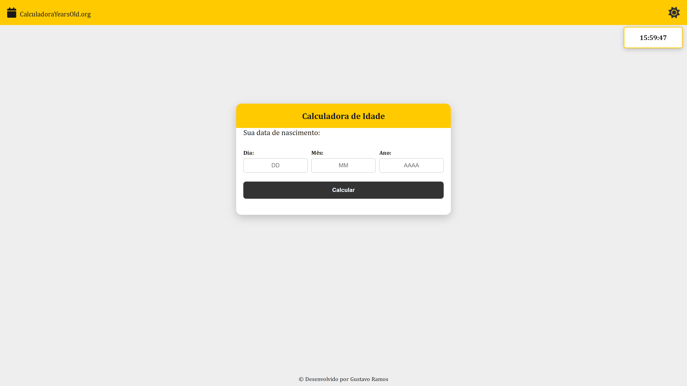

🚀 Projeto concluído: Calculadora de Idade

Mais um projeto do meu intensivo de 1 projeto por dia, praticando e aperfeiçoando minhas habilidades em HTML, CSS e JavaScript.

Neste projeto pratiquei:

* Manipulação do DOM
* Eventos de clique
* Cálculos com datas
* Condições `if`
* Tema claro e escuro
* Layout responsivo

Cada projeto é uma oportunidade de aprender algo novo e evoluir na prática.

## Preview

### Desktop

## Demonstração

## Desenvolvido por

Gustavo Ramos
